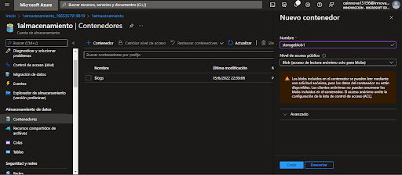
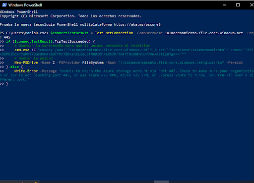
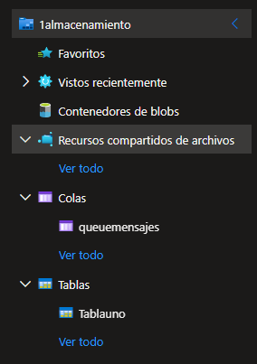
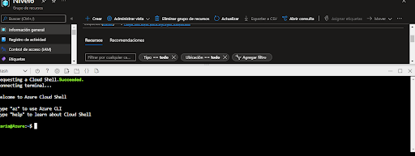
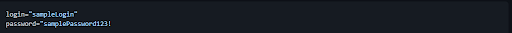
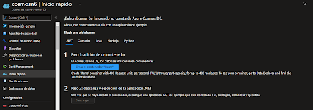
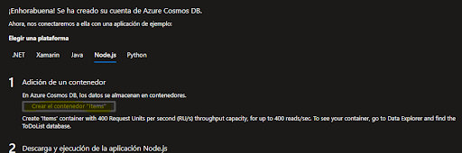

## ALMACENAMIENTO DE DATOS EN AZURE

### Es de utilidad cuando 
- Se requiere crear una pagina web estatica, no es modificable (es una alternativa)
- Se almacenan archivos, mensajes, tablas que cuentan con seguridad, alta disponibilidad, duraderos y escalables
- Almacenamiento de cantidades masivas de datos

### Recursos de Azure
- Azure Disk Blobs
- Azure Disk Files
- Azure Disk Storage

**Crear recursos de almacenamiento de Blob Storage**

Ir al [portal de Azure](https://portal.azure.com/#home)
En el buscador del portal ---> **"Cuentas de almacenamiento"** y llenar los espacios que se requieren

Se habilita **"Data Lake Storage Gen2"** para almacenamiento de gran cantidad de datos

Se clickea el recurso, y una vez ahí se selecciona la opción **“contenedores”**

Ir al recurso

Cargar el archivo a almacenar

Haciendo click en los tres puntos de la esquina superior, seleccionar la opción de **"propiedades"** y copiar el enlace

Copiando en enlace y pegando en el buscador aparece la imagen cargada

**NOTA**: Todo lo que se suba es **descargable** o **ejecutable**

Habilitar

Regresar al sitio de contenedores

Click en cargar para poder subir el archivo

Continuar con la creacion de un File Storage

Crear e ir al recurso

Cargar archivo

Se puede conectar a una unidad de almacenamiento

**NOTA**: Active directory con cuenta de Inovaccion no esta permitido
Para ejecutar abrir ventana de Azure Powershell pegarlo y enter

Archivo conectado

***Agregar una carpeta para la seguridad de las aplicaciones, desde el navegador no es posible acceder.***

### Queue Storage

Crear cola de mensajes

Acceder al apartado

**NOTA**: Se pueden ir agregando o quitando mensajes con programacion. Los mensajes no son editables.

### Creacion de tablas

Ir al buscador

Crear una tabla

Para editarla

Hacer click en **"Tablas"** y apareceran las tablas que ya se han creado

Ir al recurso creado

Se agrega la entidad

Repetir

Desde la barra de al lado se puede consultar los recursos que se han creado

### Creacion de base de SQL 

Acceder [Github](https://github.com/) y copiar lo resaltado en azul

Pegar

Lo que sucede es que se crea otro clon en el repositorio de azure

Teclear ls y a continuacion copiar el link de la siguiente carpeta

Dentro de lo que se creo hay una carpeta llamada sql

Ejecutar

Consultar la base de datos creada

Consultando la información general, se establece el firewall de servidor, lo cual permite la conexión desde algunas Ip’s y agregar tu Ip para poder realizar consultas de base de datos

Acceso para el servidor de bases de datos

Consultar los datos que hay dentro de la base de datos

Ejecutar

Para insertar un dato se puede hacer de la siguiente manera

Ejecutar y resulta lo siguiente

Ingresar a my [sql workbensh](https://www.mysql.com/products/workbench/) y hacer click en **test connection** para conectar

### Creacion de COSMOS DB

En el buscador de Azure introducir y seleccionar **“Azure Cosmos DB”** ---> **“crear”** con la opción recomendada. Se llenan los datos y a continuación **“revisar y crear”**

A continuación, se selecciona el apartado de inicio rápido y se escoge un lenguaje de programación

Descarga de una aplicación para base de datos

Para consumo

Abrir el explorador de datos

Generar un nuevo item

Hacer click en **"save"**

Seleccionar

Creación de más ítems (repetir lo anterior)

Items creados

Se selecciona un item para obtener todos los datos y seleccionar **"Save Query"**

Especificar un nombre

Ejecutar el Query para la obtención de resultados

# Sesion6
